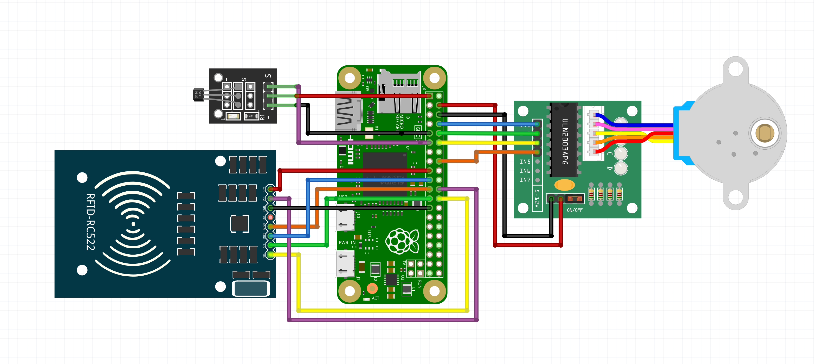

# RFID Record Player 


A modern record player that repurposes a record player coaster as an interface for controlling Spotify playback via RFID and a Raspberry Pi, combining the physical experience of vinyl with digital playback.
Features RFID detection of tagged records for Spotify content, a stepper motor–driven spinning platter, and tone arm control to start and stop playback.

## Components

- [Raspberry Pi Zero 2W (with headers)](https://amzn.to/4sl4cfk)
- [MicroSD Card](https://amzn.to/3G3Tq9W)
- [Vinyl Record Coasters](https://amzn.to/4pgyVr3)
- [28BYJ-48 ULN2003 5V Stepper Motor & ULN2003 Driver Board](https://amzn.to/4jcpeZa)
- [A3144E Hall Effect Magnetic Sensor Module](https://amzn.to/3MWDGbK)
- [RC522 RFID Reader Module (with headers)](https://amzn.to/4pcugX6)
- [NTAG213 NFC Tags](https://amzn.to/3YfJfVb)
- [5x2mm Magnet](https://amzn.to/4qw3VEw)
- [Female to Female Dupont Jumper Wires (16 ct)](https://amzn.to/4pjjwq0)

**Disclosure:** The links above are affiliate links. I may earn a commission from qualifying purchases made through them, at no extra cost to you, which helps maintain and develop this project.

## 3D Print Files

The .3MF files for printing the enclosure and other parts of the Record Player are available here: [RFID Record Player 3D Files](https://www.patreon.com/posts/148251861)

## Tutorial

See the [YouTube tutorial](https://youtu.be/fBjv4E7mpA4) for a full walkthrough of the components, wiring, assembly, and software setup.

## Wiring Diagram




### ULN2003 Stepper Motor Driver

| Pi Pin           | ULN2003 Pin |
|------------------|-------------|
| Pin 8 (GPIO 14)   | IN1         |
| Pin 10 (GPIO 15)  | IN2         |
| Pin 12 (GPIO 18) | IN3         |
| Pin 16 (GPIO 23) | IN4         |
| Pin 2 (5V)       | VCC         |
| Pin 6 (GND)      | GND         |

Note: It's usually not recommended to power the stepper motor directly from the Pi’s 5 V pin — use an external battery source or a good power supply with atleast 2A.
The stepper motor may become hot after long periods of use.

### RC522 RFID Reader (SPI)

| Pi Pin               | RC522 Pin |
|----------------------|-----------|
| Pin 24 (GPIO 8)      | SDA       |
| Pin 23 (GPIO 11)     | SCK       |
| Pin 19 (GPIO 10)     | MOSI      |
| Pin 21 (GPIO 9)      | MISO      |
| Pin 22 (GPIO 25)     | RST       |
| Pin 17 (3.3V)        | 3.3V      |
| Pin 25 (GND)         | GND       |

### A3144 Hall Effect Sensor

| Pi Pin           | A3144 Pin |
|------------------|-----------|
| Pin 11 (GPIO 17) | OUT       |
| Pin 1 (3.3V)     | VCC       |
| Pin 9 (GND)      | GND       |

## Installation

1. Clone the repository
    ```bash
    git clone https://github.com/fatihak/RFID-Record-Player.git
    cd RFID-Record-Player
    ```
2. Run the installation script
    This sets up the Python virtual environment, installs python dependencies, and enables required interfaces.
    ```bash
    bash install/install.sh
    ``` 
    Once the installation finishes, you’ll be prompted to reboot your Raspberry Pi for the changes to take effect.
3. Run the setup script
    After rebooting, activate the virtual environment and run the setup script:
    ```bash
    source venv/bin/activate
    python3 install/setup.py
    ```
4. Set up Spotify Credentials
    - Visit [Spotify For Developers](https://developer.spotify.com/dashboard/applications) and Sign In
    - In the Developer Dashboard, click "Create an App"
        - Give your app a Name and Description
        - For the Redirect URIs, enter `http://127.0.0.1:8080`
        - Check `Web API` box
    - In the setup script, enter the `Client ID`, `Client Secret`, and `Redirect URI`
    - Visit the URL to authorize your app and paste the redirected URL back.
5. Write RFID tags
    - In the setup script, choose `Write RFID tags`
    - Scan an RFID tag
    - Paste a Spotify URI for a track, album, playlist, or artist 
        - URIs follow the format `spotify:{track|album|artist|playlist}:...`
        - To copy a Spotify URI, use the desktop app, click the three dots on a song/album/artist, hover over "Share," then hold Alt (Windows) or Option (Mac) and select "Copy Spotify URI"
6. Start the Record Player 
    Once the installation is complete, run the record player script to start playing music:
    ```bash
    source venv/bin/activate
    python3 record_player.py
    ```

After the installation, your spotify credentials will be stored in a .env file and the RFID ID mapping will be in a rfid.json file in the root of the repository.

## Sponsoring

This project is maintained and developed with the help of sponsors. If you enjoy the project or find it useful, consider supporting its continued development.

<p align="center">
<a href="https://github.com/sponsors/fatihak" target="_blank"></a>
<a href="https://www.patreon.com/akzdev" target="_blank"></a>
<a href="https://www.buymeacoffee.com/akzdev" target="_blank"></a>
</p>
